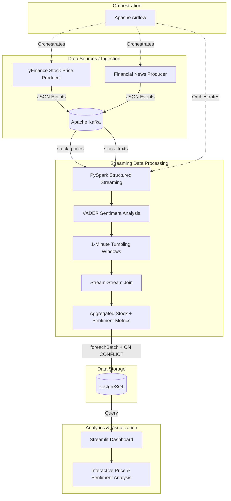

# 📈 Real-Time Stock Sentiment Pipeline

> **End-to-end real-time data engineering and data science pipeline for correlating stock price movements with financial news sentiment.**

[](https://www.python.org/)
[](https://spark.apache.org/)
[](https://kafka.apache.org/)
[](https://www.postgresql.org/)
[](https://airflow.apache.org/)
[](https://www.docker.com/)

## 🎯 Project Overview

Financial markets generate high-volume, continuously changing data from multiple sources. This project demonstrates how to build a **real-time data platform** that ingests market data and financial news, performs distributed stream processing and NLP sentiment analysis, stores the resulting analytics in PostgreSQL, and exposes the results through an interactive dashboard.

The pipeline combines **data engineering and data science workflows** into a single end-to-end system:

**Real-time ingestion → Streaming processing → NLP sentiment analysis → Temporal correlation → Idempotent storage → Visualization**

The project was designed to demonstrate production-oriented concepts that are relevant to modern **Data Engineering, Data Science, and Analytics Engineering** roles.

---

## 💼 Why This Project Matters

This project demonstrates the ability to move beyond standalone scripts or notebooks and build a complete data product.

### Data Engineering

* Designed a **multi-source streaming architecture** using Apache Kafka.
* Built distributed streaming transformations using **PySpark Structured Streaming**.
* Implemented **stream-stream joins** between stock prices and financial news.
* Applied **event-time windowing and watermarks** to manage streaming state and late-arriving data.
* Implemented **idempotent database writes** using `foreachBatch` and PostgreSQL `ON CONFLICT`.
* Containerized the platform using **Docker and Docker Compose**.
* Automated pipeline execution and lifecycle management using **Apache Airflow**.
* Added service health checks and startup dependencies to improve infrastructure reliability.

### Data Science / NLP

* Applied **VADER sentiment analysis** to financial news text.
* Used **Pandas UDFs and Apache Arrow** to improve the performance of Python-based sentiment processing.
* Aggregated sentiment over time windows.
* Joined sentiment metrics with stock price data to create a combined analytical dataset.
* Built an interactive dashboard for exploring the relationship between **market prices and news sentiment**.

### Software Engineering

* Organized the project into separate ingestion, processing, storage, orchestration, and visualization components.
* Used environment variables for configuration instead of hardcoding database connection settings.
* Designed database writes to remain safe when streaming micro-batches are retried.
* Used Docker networking and service discovery for communication between pipeline components.
* Structured the system so individual components can be replaced or extended independently.

---

# 🏗️ Architecture



---

# 🔄 Data Flow

### 1. Real-Time Ingestion

Two producers generate streaming events:

**Stock Price Producer**

* Retrieves stock market data through `yFinance`.
* Produces structured JSON price events.
* Publishes events to Kafka.

**Financial News Producer**

* Produces financial news text events.
* Publishes events to a separate Kafka topic.

Example event flow:

```text
Stock Producer ──────┐
                     ├──> Kafka ───> Spark Structured Streaming
News Producer ───────┘
```

---

### 2. Kafka Message Broker

Apache Kafka acts as the durable streaming layer between producers and consumers.

Separate topics are used for:

```text
stock_prices
stock_texts
```

This decouples ingestion from processing and allows the Spark streaming application to consume events independently of the producers.

---

### 3. Distributed Stream Processing

PySpark Structured Streaming consumes both Kafka streams and performs:

* Data parsing
* Schema application
* Timestamp processing
* Sentiment analysis
* Time-based aggregation
* Stream-stream joining

The pipeline uses **1-minute tumbling windows** to transform continuously arriving events into manageable analytical intervals.

---

### 4. NLP Sentiment Analysis

Financial news text is processed using **VADER sentiment analysis**.

The sentiment score is transformed into a numerical metric that can be aggregated alongside market data.

Conceptually:

```text
News Article
     ↓
VADER NLP
     ↓
Sentiment Score
     ↓
1-Minute Aggregation
     ↓
Join with Stock Metrics
```

The implementation uses **Pandas UDFs with Apache Arrow** rather than standard row-by-row Python UDFs, reducing serialization overhead when applying Python-based NLP logic across Spark data.

---

### 5. Stream-Stream Join

The stock-price and sentiment streams are correlated using event-time processing.

This allows the system to produce metrics such as:

```text
Time Window
    ↓
Stock Price Metrics
    +
News Sentiment Metrics
    ↓
Combined Analytical Record
```

The result can then be used to investigate whether changes in financial sentiment coincide with changes in stock prices.

---

### 6. Windowing & Watermarking

The pipeline uses:

* **1-minute tumbling windows**
* **1-minute watermarks**

Watermarking allows Spark to process late-arriving events while limiting how long historical streaming state must be retained.

This is important for preventing unbounded state growth in long-running streaming applications.

---

### 7. PostgreSQL Storage

Processed metrics are written to PostgreSQL using Spark's `foreachBatch`.

Database writes use:

```sql
ON CONFLICT
```

to make writes **idempotent**.

This means that if a micro-batch is retried, existing records can be updated rather than duplicated.

The database uses a composite key to uniquely identify analytical records.

---

### 8. Interactive Dashboard

A Streamlit application reads the processed data from PostgreSQL and presents the results through interactive visualizations.

The dashboard allows users to monitor:

* Stock price movements
* News sentiment
* Time-based trends
* Correlations between sentiment and market activity

---

# 🛠️ Technology Stack

| Category              | Technologies                             |
| --------------------- | ---------------------------------------- |
| **Programming**       | Python 3.12, SQL                         |
| **Streaming**         | Apache Kafka 7.5.0                       |
| **Stream Processing** | Apache Spark 3.5.0, Structured Streaming |
| **NLP**               | VADER Sentiment                          |
| **Data Processing**   | Pandas, Apache Arrow, Pandas UDFs        |
| **Database**          | PostgreSQL 15                            |
| **Orchestration**     | Apache Airflow 2.8.1                     |
| **Visualization**     | Streamlit, Pandas, Plotly                |
| **Infrastructure**    | Docker, Docker Compose                   |
| **Development**       | Python virtual environments, Linux/WSL   |

---

# ⭐ Key Engineering & Data Science Features

## 1. Idempotent Streaming Writes

The Spark job writes micro-batches to PostgreSQL using:

```text
Spark foreachBatch
        ↓
PostgreSQL
        ↓
ON CONFLICT
        ↓
Insert or Update
```

This protects the sink from duplicate records when Spark retries a micro-batch.

**Demonstrates:** data integrity, fault tolerance, database design, streaming reliability.

---

## 2. Stateful Stream Processing

The pipeline uses event-time windows and watermarks to manage streaming state.

```text
Continuous Events
       ↓
1-Minute Window
       ↓
Aggregation
       ↓
Watermark
       ↓
Bounded State
```

**Demonstrates:** understanding of stateful stream processing and late-arriving data.

---

## 3. Stream-Stream Joins

Stock price events and financial news events are processed as independent streams and joined using time-based logic.

**Demonstrates:** advanced Spark Structured Streaming concepts beyond simple batch transformations.

---

## 4. Vectorized NLP Processing

Sentiment analysis uses Pandas UDFs backed by Apache Arrow.

Compared with traditional Python UDF execution:

```text
Traditional Python UDF
Spark Row → Python → Spark Row
```

the vectorized approach processes data in batches:

```text
Spark Batch → Apache Arrow → Pandas → Sentiment Analysis
```

This reduces Python serialization overhead and makes Python-based transformations more suitable for distributed processing.

---

## 5. Containerized Infrastructure

Docker Compose manages the project's infrastructure, including:

* Kafka
* Zookeeper
* PostgreSQL
* Airflow
* Streamlit

This makes the environment reproducible and significantly reduces manual infrastructure setup.

---

## 6. Airflow Orchestration

An Apache Airflow DAG manages the pipeline lifecycle.

The orchestration layer is responsible for coordinating:

```text
Producers
    ↓
Spark Streaming Job
    ↓
PostgreSQL
    ↓
Dashboard
```

This demonstrates familiarity with workflow orchestration and operationalizing data pipelines.

---

## 7. Infrastructure Health Checks

Docker Compose includes health checks and startup configuration to prevent services such as Kafka and Zookeeper from being treated as ready before they have completed initialization.

This helps avoid common distributed-system startup and dependency issues.

---

# 📊 Analytical Questions

The resulting dataset can be used to investigate questions such as:

### Market & Sentiment

* Does positive financial news sentiment coincide with increases in stock prices?
* Are negative sentiment spikes associated with short-term price declines?
* How quickly does market activity change following significant sentiment events?

### Time-Based Analysis

* Which time periods experience the largest sentiment changes?
* How does average sentiment change throughout the trading day?
* Are periods of high sentiment volatility associated with greater stock-price volatility?

### Data Quality & Engineering

* How does the pipeline handle late-arriving events?
* What happens when a Spark micro-batch is retried?
* Can the system maintain data integrity during repeated writes?

These questions demonstrate how the engineering pipeline can ultimately support downstream **data analysis and decision-making**.

---

# 📂 Project Structure

```text
stock-sentiment-pipeline/
│
├── infrastructure/
│   ├── docker-compose.yml
│   │   └── Kafka, PostgreSQL, Airflow, Streamlit services
│   │
│   ├── Dockerfile
│   │   └── Custom Airflow image with Java/PySpark dependencies
│   │
│   └── dags/
│       └── stock_pipeline_dag.py
│           └── Airflow orchestration DAG
│
├── producer/
│   ├── stock_price_producer.py
│   │   └── yFinance stock price ingestion
│   │
│   └── text_sentiment_producer.py
│       └── Financial news ingestion
│
├── spark_jobs/
│   └── spark_postgres_sink.py
│       └── Streaming transformations, NLP,
│           windowing, stream-stream joins,
│           and PostgreSQL sink
│
├── postgres_db/
│   └── init_db.py
│       └── PostgreSQL schema initialization
│
├── dashboard.py
│   └── Streamlit analytics dashboard
│
├── requirements.txt
│   └── Python dependencies
│
└── README.md
```

---

# 🚀 Getting Started

## Prerequisites

Install the following:

* Docker Desktop
* Docker Compose
* Python 3.10+
* Python virtual environment
* At least 8 GB RAM allocated to Docker is recommended

---

## 1. Clone the Repository

```bash
git clone <your-repository-url>

cd stock-sentiment-pipeline
```

---

## 2. Create a Virtual Environment

```bash
python -m venv .venv

source .venv/bin/activate
```

On Windows:

```powershell
.venv\Scripts\activate
```

Install dependencies:

```bash
pip install -r requirements.txt
```

---

## 3. Start the Infrastructure

```bash
cd infrastructure

docker-compose up -d --build
```

This starts the supporting services required by the pipeline.

---

## 4. Initialize PostgreSQL

From the project root:

```bash
cd ..

export DB_HOST=localhost
export DB_PORT=5433

python postgres_db/init_db.py
```

On Windows PowerShell:

```powershell
$env:DB_HOST="localhost"
$env:DB_PORT="5433"

python postgres_db/init_db.py
```

> **Note:** The PostgreSQL port depends on the port mapping defined in `docker-compose.yml`. If you change the mapping, update `DB_PORT` accordingly.

---

## 5. Start the Pipeline Through Airflow

Open:

```text
http://localhost:8081
```

Log in using the credentials configured for the local Airflow environment.

Locate:

```text
stock_pipeline_orchestrator
```

and trigger the DAG.

The Airflow workflow coordinates the producer and Spark components.

---

## 6. Launch the Dashboard

From the project root:

```bash
export DB_HOST=localhost
export DB_PORT=5433

streamlit run dashboard.py
```

Open:

```text
http://localhost:8501
```

After the first streaming window has completed and data has been written to PostgreSQL, the dashboard will begin displaying results.

Allow approximately **60–90 seconds** for the first results to appear.

---

# 🔧 Troubleshooting

| Issue                                            | Solution                                                                                                                                                                   |
| ------------------------------------------------ | -------------------------------------------------------------------------------------------------------------------------------------------------------------------------- |
| **Docker protocol not available in WSL2**        | Open Docker Desktop → Settings → Resources → WSL Integration and ensure your WSL distribution is enabled.                                                                  |
| **Airflow/Spark reports `JAVA_HOME is not set`** | Rebuild the infrastructure using `docker-compose up -d --build` so the custom Docker image installs the required Java dependencies.                                        |
| **Dashboard shows `No data available yet`**      | Wait approximately 60–90 seconds for the first 1-minute Spark window to close and the results to be written to PostgreSQL.                                                 |
| **Port 5433 is already in use**                  | Check for another PostgreSQL service or change the Docker port mapping in `docker-compose.yml`.                                                                            |
| **Port 8081 is already in use**                  | Stop the conflicting service or change the Airflow port mapping.                                                                                                           |
| **Kafka repeatedly restarts**                    | Check the Docker Compose health checks and container logs. If necessary, stop the stack and remove the development volumes before restarting.                              |
| **Spark cannot connect to Kafka**                | Verify that Kafka is healthy and that the Spark job uses the Docker Compose service name rather than an incorrect localhost address when communicating between containers. |

Useful diagnostic commands:

```bash
docker-compose ps
```

```bash
docker-compose logs kafka
```

```bash
docker-compose logs airflow
```

```bash
docker-compose logs postgres
```

---

# 📌 Skills Demonstrated

## Data Engineering

```text
Apache Kafka
Apache Spark Structured Streaming
Stream-Stream Joins
Event-Time Processing
Windowing
Watermarking
PostgreSQL
Idempotent Data Sinks
Airflow
Docker
Docker Compose
ETL / ELT Architecture
Data Pipeline Design
Fault Tolerance
Data Quality
```

## Data Science / Analytics

```text
NLP
Sentiment Analysis
VADER
Feature Engineering
Time-Series Aggregation
Exploratory Analysis
Correlation Analysis
Data Visualization
```

## Programming

```text
Python
SQL
Pandas
PySpark
Apache Arrow
Pandas UDFs
Bash
```

---

# 🧠 What I Learned

Building this project provided hands-on experience with several concepts that are difficult to understand through isolated tutorials.

### From a Data Engineering perspective

I learned how to:

* Design a multi-stage streaming architecture.
* Work with Kafka producers and consumers.
* Process continuously arriving data with Spark Structured Streaming.
* Manage state using windows and watermarks.
* Join multiple real-time streams.
* Design database sinks that remain safe during retries.
* Orchestrate distributed components using Airflow.
* Containerize a complete data platform using Docker.

### From a Data Science perspective

I learned how to:

* Integrate NLP into a production-style data pipeline.
* Convert unstructured financial text into numerical sentiment features.
* Aggregate NLP features over time.
* Combine unstructured text signals with structured market data.
* Build visualizations that make streaming analytical results accessible.

---

# 🚧 Limitations

This project is intentionally designed as a portfolio-scale implementation rather than a production financial trading system.

Current limitations include:

* The financial news producer is simulated rather than connected to a production news provider.
* VADER is a general-purpose sentiment model and is not specifically trained for financial language.
* The system currently targets a limited ticker/watchlist configuration.
* The infrastructure is designed for local Docker deployment rather than a cloud production environment.
* The dashboard is intended for analytical monitoring rather than automated trading decisions.

These limitations provide clear opportunities for future development.

---

# 🔮 Future Enhancements

## 1. Financial NLP with FinBERT

Replace VADER with a finance-specific transformer model such as **FinBERT**.

```text
Financial News
      ↓
FinBERT
      ↓
Financial Sentiment
      ↓
Spark Aggregation
```

This would provide a more domain-specific approach to sentiment classification.

---

## 2. Real-Time News Sources

Replace the simulated news producer with real APIs or streaming sources such as:

* Financial news APIs
* Reddit
* Other publicly available financial data sources

The ingestion layer could remain Kafka-based while changing only the producer implementation.

---

## 3. Multi-Ticker Support

Expand the pipeline to dynamically support a watchlist such as:

```text
AAPL
TSLA
NVDA
GOOGL
AMZN
MSFT
```

The dashboard could then provide ticker-level filtering and comparison.

---

## 4. Cloud Deployment

Move the local architecture to a cloud environment.

### AWS

```text
Kafka          → Amazon MSK
Spark          → EMR
PostgreSQL     → Amazon RDS
Airflow        → MWAA
Object Storage → Amazon S3
```

### GCP

```text
Kafka          → Managed Kafka
Spark          → Dataproc
PostgreSQL     → Cloud SQL
Airflow        → Cloud Composer
Object Storage → Cloud Storage
```

This would extend the project into a cloud-native data engineering architecture.

---

## 5. Data Lake / Medallion Architecture

Introduce persistent raw and processed data layers:

```text
                 ┌── Bronze: Raw Events
Kafka ───────────┤
                 ├── Silver: Cleaned & Enriched
                 │
                 └── Gold: Analytical Metrics
```

This would allow historical analysis in addition to real-time monitoring.

---

## 6. Data Quality & Observability

Future versions could add:

* Automated data quality checks
* Pipeline monitoring
* Failure alerts
* Data lineage
* Structured logging
* Metrics and monitoring dashboards
* Automated testing

Potential tools include Great Expectations, dbt, Prometheus, and Grafana.

---

# 🎓 Resume-Ready Project Summary

**Real-Time Stock Sentiment Pipeline | Python, Kafka, PySpark, Airflow, PostgreSQL, Docker**

Built an end-to-end real-time streaming platform that ingests stock prices and financial news, applies distributed NLP sentiment analysis with PySpark, correlates market and sentiment metrics using event-time stream-stream joins, and serves results through an interactive Streamlit dashboard.

### Resume Highlights

* **Engineered** a real-time streaming pipeline using **Apache Kafka and PySpark Structured Streaming** to ingest, transform, window, and join stock-price and financial-news streams.
* **Implemented** event-time processing with **1-minute tumbling windows and watermarks** to handle late-arriving events while bounding streaming state.
* **Developed** vectorized **Pandas UDFs with Apache Arrow** for distributed VADER sentiment analysis, converting unstructured financial news into time-series analytical features.
* **Designed** an idempotent PostgreSQL sink using Spark `foreachBatch` and `ON CONFLICT`, preventing duplicate records during micro-batch retries.
* **Orchestrated and containerized** the pipeline using **Apache Airflow, Docker, and Docker Compose**, including service health checks and dependency management.
* **Built** an interactive **Streamlit dashboard** to visualize stock-price movements alongside aggregated financial sentiment metrics for near real-time analysis.

---

# 📷 Pipeline in Action

Add screenshots/GIFs of your project here to give recruiters an immediate visual understanding of the system.

Recommended screenshots:

1. **Airflow DAG** showing the pipeline successfully running.
2. **Kafka/Spark pipeline** running in Docker.
3. **PostgreSQL results** showing processed records.
4. **Streamlit dashboard** showing stock price and sentiment metrics.

Example:

```text
docs/
├── airflow-dag.png
├── kafka-spark.png
├── postgres-results.png
└── dashboard.png
```

Then embed them in the README:

```markdown


```

---

# 👨‍💻 Project Focus

This project was built to demonstrate practical experience across the modern data lifecycle:

```text
                    DATA SOURCES
                         │
                         ▼
                  DATA INGESTION
                         │
                         ▼
                       KAFKA
                         │
                         ▼
                STREAM PROCESSING
                         │
                ┌────────┴────────┐
                ▼                 ▼
             SPARK              NLP
                │                 │
                └────────┬────────┘
                         ▼
                 DATA CORRELATION
                         │
                         ▼
                  POSTGRESQL
                         │
                         ▼
                  DATA ANALYSIS
                         │
                         ▼
                  VISUALIZATION
                         │
                         ▼
                BUSINESS INSIGHTS
```

**The goal is not simply to process stock data—it is to demonstrate the ability to design, build, orchestrate, and analyze a complete data pipeline from ingestion to insight.**

---

# ⭐ Author

Built as a portfolio project demonstrating practical skills in **Data Engineering, Data Science, Streaming Analytics, NLP, and Cloud-Oriented Data Architecture**.

If you found this project interesting, feel free to explore the implementation and follow the evolution of the project through its future enhancements.
